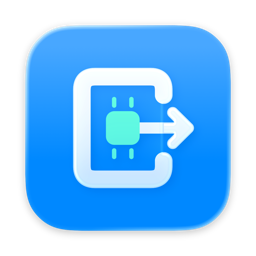

<p align="center"></p>

# MLX Gateway

[产品主页](https://kamisato-yuna.github.io/MLX-Gateway/) · [English](README.en.md) · [MIT](LICENSE) · [参与贡献](CONTRIBUTING.md) · [安全报告](SECURITY.md)

[](https://github.com/Kamisato-Yuna/MLX-Gateway/actions/workflows/ci.yml)

原生 macOS Liquid Glass 应用，将你的本地 MLX 模型连接到支持 **OpenAI Responses** 的客户端。使用 **Swift 6**，运行于 Apple Silicon；手动启停一个模型，清楚看到状态与日志。

- **你的目录，你的模型**：指定 MLX 运行目录，自动扫描模型；Python 与模型目录可分别选择。
- **一个统一出口**：Responses 文本、流式、函数工具与存储会话；视觉模型支持图像与内联 PDF，客户端使用固定的 `base_url`。
- **按需使用内存**：同一时刻运行一个模型，切换时先停止旧进程，退出应用也会释放它启动的服务。
- **原生交互**：侧栏选择、复制模型 ID / 地址反馈、启动与停止快捷键、实时日志与独立自动滚动控制。
- **模型调试**：预置与自定义 Responses 测试、完整 JSON 编辑、原始 SSE 事件和工具结果提交。
- **性能观察**：CPU/内存趋势、请求耗时与 token 统计、串行预置性能测试和 JSON 导出。
- **客户端更新**：从 GitHub Release 或 Pages 检查、下载更新，验证后安装并重启。
- **本地优先**：只读模型，离线加载；模型权重与 Python 环境不随源码提供。

项目处于早期开发阶段。客户端安装包见 [GitHub Releases](https://github.com/Kamisato-Yuna/MLX-Gateway/releases/latest)，支持 macOS 26+ / Apple Silicon；具体签名、公证与验收结果随版本说明发布。MIT 仅覆盖本项目代码与原创图标；模型和第三方依赖遵守各自许可证。

## 快速开始

需要 macOS 26+、Apple Silicon，以及装有 `mlx-lm` / `mlx-vlm` 的 Python 环境。

1. 从 [Release](https://github.com/Kamisato-Yuna/MLX-Gateway/releases/latest) 下载并解压 arm64 ZIP，将 `MLXGateway.app` 移到应用程序目录后打开；从源码开发另需 Xcode 27，参见 [构建说明](#build-and-run)。
2. 进入「设置」（⌘,），选择 **MLX 运行目录**。默认使用其中的 `.venv/bin/python` 和 `models/`，也可改为任意已有环境与模型目录。
3. 点击「保存并扫描」。从侧栏选择扫描到的模型，点击「启动模型」（⌘R），等待「服务就绪」。
4. 复制模型 ID 和 `base_url` 到客户端，调用 `responses.create`。
5. 点击「停止模型」（⌘.）释放内存。选择另一模型后点击「切换并启动」；切换会终止旧模型及其在途请求。

典型目录（也支持独立的 Python 环境、嵌套模型目录或直接选择单个模型目录）：

```text
MLX/
├── .venv/bin/python
└── models/
    ├── my-text-model/
    │   ├── config.json
    │   └── *.safetensors
    └── my-vision-model/
        ├── config.json
        └── *.safetensors
```

可用以下命令准备新的 Python 环境；模型请自行从可信来源获取与 MLX 后端兼容的完整权重、tokenizer 和配置。

```bash
python3 -m venv ~/MLX/.venv
~/MLX/.venv/bin/python -m pip install mlx-lm mlx-vlm
mkdir -p ~/MLX/models
```

扫描读取 `config.json` 中的 `model_type`，根据 `vision_config` 等视觉配置判断使用 `mlx_lm` 或 `mlx_vlm`。扫描最多进入五层子目录，忽略隐藏目录和目录符号链接，发现模型配置后不再深入该模型目录；权重文件本身可以是符号链接。相对目录名作为模型 ID，嵌套的同名模型不会冲突。无效配置会提示跳过。

**扫描到模型不等于后端支持该架构或权重完整**；实际加载错误会显示在状态与日志中。视觉模型可以接受图像和内联 PDF；具体能力见接口表，并取决于安装的 MLX 后端与模型。刷新按钮会重新扫描磁盘，运行模型时先停止再刷新。

选择模型本身不会启动服务。API 请求不会自动启动或切换模型：未就绪返回 503，模型不匹配返回 409。所选模型会记住，下次打开应用仍需手动启动。

## 连接与日志

默认网关 `127.0.0.1:44110`，默认 MLX 服务 `127.0.0.1:44100`。在「设置」中修改主机与端口，两个端口必须不同；运行模型时设置可查看，停止后可保存。

默认仅本机访问。服务没有应用级认证，请勿直接暴露到不受信任的网络；详见 [安全说明](SECURITY.md)。

日志每 0.75 秒刷新，显示最近 64 KB。关闭「跟随最新」只暂停自动滚动，日志继续更新。可搜索并高亮命中文本，错误/警告/成功日志使用不同颜色。「清理运行日志」确认后清空历史，运行中的模型继续追加新日志。完整日志保留在 `~/Library/Logs/MLXGateway/backend.log`，右上角文件夹按钮可在访达中定位；分享前请脱敏。

设置保存在本机 UserDefaults。命令行工具也支持 `MLX_GATEWAY_RUNTIME`、`MLX_GATEWAY_MODELS`、`MLX_GATEWAY_PYTHON`，优先于保存的目录值；环境变量应在应用启动前设置，Finder 启动推荐使用界面设置。

## 工作面板

主窗口提供运行日志、快速测试、性能分析和客户端更新。切换面板保留草稿和运行状态。快速测试支持自定义端点与仅驻留内存的 API key，完整 JSON 原样发送；输入、输出和 SSE 原始事件可检查。预置是调试起点，兼容端点或本地后端不支持的功能会显示实际错误。

性能面板记录本次启动的模型资源曲线与请求统计，支持自定义提示词和多轮测试。TTFT 只在真实流式内容到达时记录，非流式显示缺失；输出 tok/s 含请求总耗时，不能当作纯解码速度。参见 [面板说明](docs/client-panels.md) 和 [客户端更新](docs/updates.md)。

## 接口

| 方法 | 路径 | 用途 |
| --- | --- | --- |
| GET | `/health` | 网关监听状态，不代表模型推理成功 |
| GET | `/status` | 当前 MLX 状态、模型、PID 与协议能力 |
| GET | `/v1/models` | 已配置模型及网关开放能力 |
| POST | `/v1/responses` | 非流式或渐进 SSE 推理 |
| GET / DELETE | `/v1/responses/{id}` | 查询或删除已保存响应 |
| GET | `/v1/responses/{id}/input_items` | 分页读取输入历史 |
| POST | `/v1/responses/{id}/cancel` | 取消后台响应 |

Anthropic `/v1/messages` 和公开 `/v1/chat/completions` 返回 404。Chat Completions 仅用于网关到 MLX 的内部传输。模型 ID 必须对应当前手动启动的模型；请求不能触发模型自动启动或切换。

| Responses 能力 | MLX LM | MLX VLM |
| --- | --- | --- |
| 文本输入、instructions、历史消息、usage | 支持 | 支持 |
| 渐进 SSE、流式终止与错误 | 支持 | 支持 |
| function 工具与 function_call_output | 依赖模型工具模板 | 依赖模型工具模板 |
| 严格函数参数 schema | 明确不支持 | 明确不支持 |
| JSON Schema 约束输出 | 明确不支持 | 使用后端约束解码 |
| 图片输入 | 明确不支持 | 支持 |
| 内联 UTF-8 文本文件 | 支持 | 支持 |
| 内联 PDF | 明确不支持 | 提取文字并渲染页面图像 |
| store / previous_response_id / 后台任务 | 支持，由网关管理 | 支持，由网关管理 |

请求可包含 `model`、`input`、`instructions`、`max_output_tokens`、`temperature`、`top_p`、`metadata`、`stream`、`store`、`tools`、`tool_choice`、`text.format`、`previous_response_id`、`background` 等已实现字段。函数工具只生成调用，不在网关内执行；客户端明确提交工具结果后继续请求。

`store=true` 会话保存在本次网关进程内存，重启清空；容量和到期策略由 `/status` 说明。`previous_response_id` 恢复历史输入输出，不继承上一轮 `instructions`。达到输出预算时返回 `incomplete`，并保留实际 usage。

不会读取请求中的任意本机文件路径；内联文件通过 `file_data` 提交。`file_id` / `file_url`、音频、云托管工具、未实现参数等明确返回错误，不静默丢弃。模型架构、工具模板与下游版本仍决定是否能实际完成请求；这不是 OpenAI 云服务全部托管能力的替代。

## Build And Run

本地验证使用 Xcode 27 beta 6（27A5252f）、Swift 6 语言模式、macOS 26+，**仅 arm64**。默认脚本选择 `/Applications/Xcode-beta.app/Contents/Developer`，可通过 `DEVELOPER_DIR` 指定其他 Xcode 27 安装位置。

```bash
git clone https://github.com/Kamisato-Yuna/MLX-Gateway.git
cd MLX-Gateway
./script/build_and_run.sh --build   # 仅构建
./script/build_and_run.sh           # 正常退出旧应用，构建并打开
./script/build_and_run.sh --verify  # arm64、严格开发签名、进程和 /health
./script/build_and_run.sh --logs    # 构建运行，并跟随应用 unified log
```

Debug 使用 Xcode 原生 Apple Development 签名。维护者团队为 `852H844JG2`；外部贡献者在 Xcode Signing 中选择自己的团队，或通过以下方式覆盖，不需要维护者的证书：

```bash
MLX_GATEWAY_TEAM=YOUR_TEAM_ID \
MLX_GATEWAY_SIGN_IDENTITY='Apple Development' \
./script/build_and_run.sh --verify
```

构建结果为 `build/DerivedData/Build/Products/Debug/MLXGateway.app`。`--verify` 默认检查 44110，修改连接设置后可传 `MLX_GATEWAY_URL=http://127.0.0.1:你的端口`。

`run`、`--verify`、`--logs` 会正常退出已有应用，停止其模型。`--logs` 是应用 unified log，MLX 子进程日志在应用内查看。`--clean` 会停止应用并删除本仓库的构建产物，仅在你确实需要清理时使用。

仅检查编译而没有开发证书时，可以使用 Release 编译配置；此产物不用于分发：

```bash
xcodebuild -project MLXGateway.xcodeproj -scheme MLXGateway \
  -configuration Release -destination 'platform=macOS,arch=arm64' \
  -derivedDataPath build/CI CODE_SIGNING_ALLOWED=NO build
```

## 验证

```bash
./script/test.sh
./script/test-responses-playground.sh
./script/test_performance.sh
./script/test_updates.sh
```

Swift 6 测试使用临时模型目录和独立端口 44219 / 44220 的 HTTP fixture，覆盖目录扫描、Responses 转换与流式/工具/会话、已移除路由、手动启停、切换、在途请求取消、占用端口、异常退出与日志。不下载权重，也不证明真实 MLX 推理。GitHub Actions 使用官方 `xcode-27` 预览运行器执行这些测试并编译应用和图标，不自动发布产物。

明确需要真实模型验证时，先停止应用管理的模型，再执行：

```bash
MLX_GATEWAY_RUNTIME="$HOME/MLX" ./script/test.sh --live
```

该模式依赖运行环境内的 `openai` Python 包，在 44319 / 44320 端口按扫描结果顺序加载 **全部模型**，验证 SDK Responses 返回后停止；结果留在 `build/verification/`。它可能消耗较多时间和内存，不替代真实界面的点击验收。

## 客户端示例

先在应用中手动启动模型，把复制的 ID 填入示例。不需要 OpenAI 云端密钥：

```python
from openai import OpenAI

client = OpenAI(base_url="http://127.0.0.1:44110/v1", api_key="local")
response = client.responses.create(
    model="my-text-model",  # 粘贴应用中复制的模型 ID
    input="只回复：你好",
    max_output_tokens=128,
    store=False,
)
print(response.output_text)
```

[Responses 官方参考](https://developers.openai.com/api/reference/resources/responses/methods/create) · [Swift 6 迁移文档](https://www.swift.org/migration/) · [Xcode 27 CI 运行器说明](https://github.com/actions/runner-images/issues/14404)

0.2.0 的界面、协议、更新与发布验证见 [版本验证记录](docs/verification-0.2.0.md)；早期版本记录见 [验证记录](docs/verification.md)。

## 参与项目

查看 [贡献指南](CONTRIBUTING.md)、[更新记录](CHANGELOG.md)，在 [Discussions](https://github.com/Kamisato-Yuna/MLX-Gateway/discussions) 交流。原创图标的三层 SVG 和 Icon Composer 工程随仓库提供，可继续编辑；意象为本地芯片、统一网关与响应输出。
